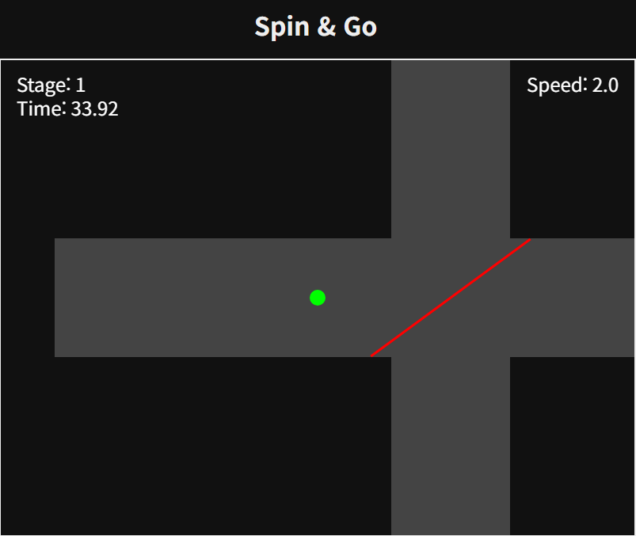

# Spin & Go

**Spin & Go**는 낯선 공간을 탐험하며 출구를 찾아 나아가는 탑다운 방식의 웹 게임입니다. 플레이어는 매 스테이지마다 변화하는 장애물을 피해 다음 단계로 나아가야 합니다. 이 프로젝트는 원래 더 큰 서사를 가진 게임의 데모 버전으로 시작되었으나, 그 자체로도 충분한 재미를 제공하는 하나의 완성된 미니 게임입니다.

## ✨ 주요 기능

*   **절차적으로 생성되는 맵:** 각 스테이지마다 출구의 위치가 무작위로 변경되어 새로운 느낌을 줍니다.
*   **점진적인 난이도 상승:** 총 20개의 스테이지를 거치며 장애물의 날개 개수, 회전 속도, 길이, 두께가 점차 복잡해지고 어려워집니다.
*   **다양한 조작 방식:**
    *   **키보드:** `W`, `A`, `S`, `D` 또는 방향키로 조작할 수 있습니다.
    *   **마우스/터치:** 화면을 클릭하거나 터치하면 나타나는 가상 조이스틱으로 플레이어를 움직일 수 있습니다.
    *   **마우스 휠:** 마우스 휠을 위아래로 스크롤하여 플레이어의 이동 속도를 세밀하게 조절할 수 있습니다.
*   **직관적인 HUD:** 현재 스테이지, 총 플레이 시간, 플레이어 속도를 화면에 표시하여 게임 상황을 쉽게 파악할 수 있습니다.
*   **스토리와 엔딩:** 게임 시작 시 개발자의 메시지가 담긴 인트로 팝업이 나타나며, 마지막 스테이지를 클리어하면 극적인 연출과 함께 엔딩 시퀀스가 펼쳐집니다.

## 🎮 게임 방법

1.  **목표:** 회전하는 장애물을 피해 복도를 탐험하고, 파란색 출구를 찾아 다음 스테이지로 이동하세요. 최종 20 스테이지를 클리어하면 엔딩을 볼 수 있습니다.
2.  **조작법:**
    *   **이동:** 키보드(WASD, 방향키) 또는 가상 조이스틱을 사용해 플레이어를 움직입니다.
    *   **속도 조절:** 마우스 휠을 사용해 플레이어의 속도를 0.0에서 5.0까지 조절할 수 있습니다.
3.  **주의사항:** 장애물에 닿으면 **1 스테이지**로 돌아가게 되니 주의하세요!

## 💻 사용 기술

*   **HTML5 Canvas**
*   **JavaScript (ES6+)**
*   **CSS3**

## 📝 개발 일지

이 게임의 개발 과정과 고민의 흔적들은 아래 개발 일지에서 더 자세히 확인하실 수 있습니다.

*   [**2025-08-22:** 레벨 디자인 및 기능 추가](2025-08-22-Spin-Go-Level-Design-and-Features.md)
*   [**2025-08-25:** 장애물 시스템 개선 및 버그 수정](2025-08-25-Spin-Go-Development-Log.md)
*   [**2025-08-26:** 최종 연출 완성 및 배포](2025-08-26-Spin-Go-Finalization.md)

## 🚀 실행 방법

이 프로젝트는 웹 기반 게임이므로, `index.html` 파일을 웹 브라우저에서 열기만 하면 바로 플레이할 수 있습니다. 별도의 설치 과정은 필요하지 않습니다.
